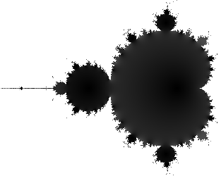
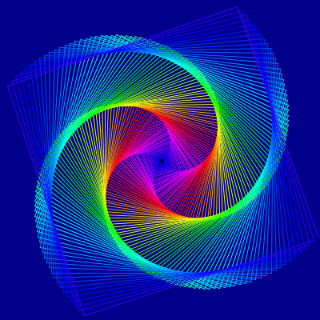

<p align="center">
  
</p>

<h1 align="center">The Aya Programming Language</h1>

<p align="center">
  
</p>

## Features

  - Terse, yet readable syntax
  - Standard library written in aya code
  - Key-value pair dictionaries and objects
  - Number types: double, arbitrary precision float, rational, and complex
  - Basic support for objects and data structures using metatables
  - Pre-evaluation stack manipulation (custom infix operators)
  - List comprehension
  - String Interpolation, Unicode, and special characters
  - Interactive GUI
  - Built in plotting, graphics, and gui dialog library
  - I/O operators for file streams, web downloads, tcp/sockets, and more
  - Interactive help and Documentation
  - Metaprogramming

## Overview

Aya is a terse stack based programming language originally intended for code golf and programming puzzles. The original design was heavily inspired by [CJam](https://sourceforge.net/p/cjam/wiki/Home/) and [GolfScript](http://www.golfscript.com/golfscript/). Currently, Aya is much more than a golfing language as it supports user-defined types, key-value pair dictionaries, natural variable scoping rules, and many other things which allow for more complex programs and data structures than other stack based languages.

Aya comes with a standard library written entirely in Aya code. The standard library features types such as matrices, sets, dates, colors and more. It also features hundreds of functions for working working on numerical computations, strings, plotting and file I/O. It even features a basic turtle library for creating drawings in the plot window.

Aya also features a minimal GUI that interfaces with Aya's stdin and stdout. The GUI features plotting, tab-completion for special characters, and an interactive way to search QuickSearch help data.

## Useful Links

  - [A Tour of Aya](https://github.com/nick-paul/aya-lang/wiki/A-Tour-of-Aya)
  - [Documentation / Wiki](https://github.com/nick-paul/aya-lang/wiki)
  - [Examples](https://github.com/nick-paul/aya-lang/tree/master/examples)
  - [Esolang Wiki](http://esolangs.org/wiki/Aya)


## Examples


### Hypotenuse Formula

Given side lengths `a` and `b` of a right triangle, compute the hypotenuse `c`

  - `x y ^`: Raise `x` to `y`th power
  - `x y +`: Add `x` and `y`
  - `x .^`: Square root of x

```
{a b,
    a 2 ^ b 2 ^ + .^
}:hypot;

aya> 3 4 hypot
5
```

Pure stack based (no local function variables)

```
aya> {J2^S.^}:hypot;
```

  - `x y J`: Wrap `x` and `y` in a list (`[x y]`)
  - `[] 2 ^`: Broadcast `2 ^` across the list
  - `[] S`: Sum the list
  - `z .^`: Square root

Operator breakdown: 

```
aya> 3 4 J
[ 3 4 ] 
aya> 3 4 J 2 ^
[ 9 16 ] 
aya> 3 4 J 2 ^ S
25 
aya> 3 4 J 2 ^ S .^
5 
```

### Primality Test

Test if a number is prime *(without using aya's built-in primaity test operator `G`)*

Algorithm utilzing stack-based concatenative programming and aya's operators

Note that `R`, `B`, and `S` (and all other uppercase letters) are operators just like `+`, `-`, `*`, `/`, etc.

```
aya> { RB\%0.=S1= }:isprime;
aya> 11 isprime
1
```

Same algorithm using more verbose syntax
```
{n, 
    n 2 < {
        .# n is less than 2, not prime
        0
    } {
        .# n is greater than or equal to 2, check for any factors
        .# for each number in the set [2 to (n-1)] `i`, do..
        [2 (n 1 -),] #: {i,
            .# check if (n%i == 0)
            n i % 0 =
        }
        .# If any are true (equal to 1), the number is not prime
        {1 =} any !
    } .?
}:isprime;
```


### Define a 2D vector type

Type definition:

```
struct vec {x y}

.# Member function
def vec::len {self,
    self.x 2^ self.y 2^ + .^
}

.# Print overload
def vec::__repr__ {self,
    .# Aya supports string interpolation
    "<$(self.x),$(self.y)>"
}

.# Operator overload
def vec::+ {self other,
    self.x other.x +
    self.y other.y +
    vec!
}
```

Call constructor using `!` operator and print using `__repr__` definition:

```
aya> 3 4 vec! :v
<3,4>
```

Perform operations on the type:

```
aya> v.len
5

aya> 10 10 vec! v +
<13,14>
```


### Generate a Mandelbrot Fractal

Complex numbers are built in to aya's number system can can be used seamlessly with other numeric types. Aya also includes a graphics library. The `viewmat` module uses it to draw a 2d intensity image.

```
import ::matrix
import ::viewmat

400 :width;
width 0.8* :height;

.# Create complex plane
[:2 0.5 width.linspace] matrix! :x;
[1 :1  height.linspace] matrix! .t :y;
y :0i1 * x + :a;

.# Generate the fractal
a E matrix.zeros {2^a+} 20 % .|

.# Display
{3 .>} O viewmat.show
```




### Draw Using a Turtle

Use aya's `turtle` and `color` modules to draw a pattern

```
import ::turtle
import ::color

{,
    400:width;
    400:height;
    color.colors.darkblue :bg_color;
} turtle!:t;

5 :n;
color.colors.blue :c;

{
    n t.fd
    89.5 t.right
    1 c.hueshift :c;
    c t.pencolor 
    n 0.75 + :n;
} 400 %
```




### Load, Examine, and Visualize Datasets

```
import ::dataframe
import ::plot
import ::stats

"Downloading file..." :P
{,
    "https://raw.githubusercontent.com/vincentarelbundock/Rdatasets/master/csv/datasets/LakeHuron.csv":filename
    1:csvindex
}
dataframe.read_csv :df;

df.["time"] :x;
df.["value"] :y;

.# stats.regression returns a function
x y stats.regression :r;

plot.plot! :plt;
x y   {, "Water Level":label} plt.plot
x {r} {, "Trend":label} plt.plot

"Water Level of Lake Huron" plt.:title;
[575 583] plt.y.:lim;
1 plt.y.:gridlines;
"####" plt.x.:numberformat;
2 plt.:stroke;

plt.view
```


### Interactive help

Search the interactive help from the repl using `\? <hepl text>` or from the IDE using `Ctrl+Q`

```
aya> \? cosine
MC (N) V
     N: inverse cosine
     overloadable: __acos__
Mc (N) V
     N: cosine
     overloadable: __cos__
```


## Installation

Download the latest release from the release page ([https://github.com/nick-paul/aya-lang/releases](https://github.com/nick-paul/aya-lang/releases)) and unpack the archive.

Aya requires Java 8. To run the GUI, double click the jar file or run the command:

```
java -jar aya.jar
```

To run Aya interactively from the command line use `-i`

```
java -jar aya.jar -i
```

To run scripts from the command line:

```
java -jar aya.jar filename.aya
```

## Contributing

If you find any bugs or have any feature or operator ideas, please submit an issue on the issue page. Alternively, implement any feature or bugfix yourself and submit a pull request.
