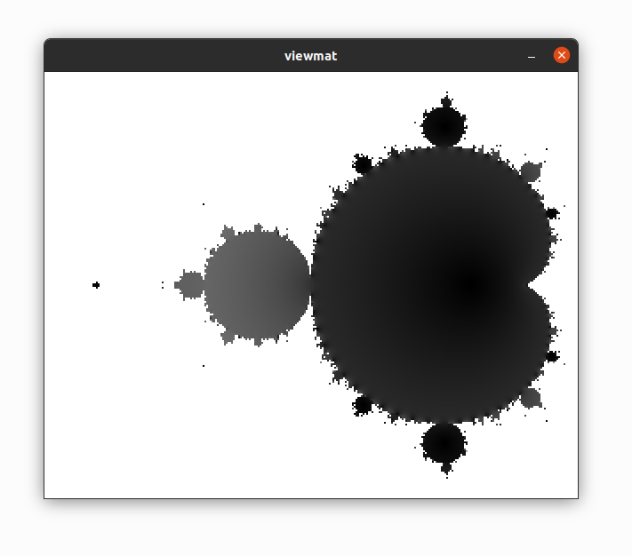

# Running / Installation

Aya is written in java. Please ensure you have the latest version of java on your system. 

Download the latest release from the [releases page](https://github.com/aya-lang/aya/releases).

Once downloaded, simply double click `aya.jar` to run the aya GUI. 

If your system does not support double clicking a jar to run it, you may optionally run it using the following command:

```
java -jar aya.jar
```

**NOTE**: `aya.jar` must be in the same directory as the rest of the files included in the download.

## Running Examples

There are many example scripts in the `examples/` directory. To run an example, type its name followed by the `example` command:

```
aya> "nth_fib" example
The first 10 fib numbers are [ 1 1 2 3 5 8 13 21 34 55 ]
```

Some examples are in subfolders such as `canvas`, `turtle`, or `plot`. Run them using `subfolder/example_name`:

```
aya> "canvas/mandelbrot" example
```



## Command Line Arguments

All arguments are optional. 

  - The first argument is the directory to point aya at when running.
  - If the second argument is `-i`, run the aya repl directly in the terminal.
  - All the following arguments are scripts to run


```
$ ls my_scripts/aya_scripts/
hello.aya
$ rlwrap java -jar ~/git/aya/aya.jar my_scripts/aya_scripts/ -i
aya> "hello.aya" :F
Hello world!
```

## System Install

This step is only needed if you would like to add aya to your systems path. *Currently only supports OSX/Linux*

Aya supports running scripts directly from the command line. For example:

```
$ cat hello.aya 
#!/usr/bin/env aya
"Hello world!" :P

$ chmod +x hello.aya

$ ./hello.aya 
Hello world!
```

To enable this, add `aya/runnable/linux` to your path:

For example, you can add this line to your bashrc:

```
PATH="$PATH:/<path_to_aya>/aya/runnable/linux"
```
